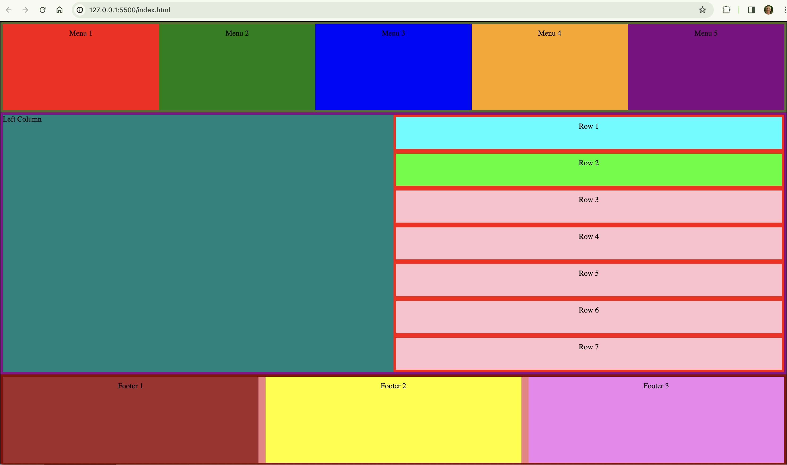

# Assignment 0-b Flex

This is a project to help you understand how to use nested flex box containers.

It looks like this when you run it.

## Assignment

Add borders of your own choosing to make the nested flex containers stand out in your own mind, maybe something like this?

## How to consume this project?

Consume this as you did `https://github.com/CodersCampus/Assignment0Template` by clicking green template button, creating a repository on your github account, and then cloning down to your local box.

Then run it on your box. Push it back up to your github account for future reference!

## What to look for

1. Look for the flex containers nested inside the flex containers!!!
2. Look how this page resizes itself. You don't need margins or padding or ...
3. Experiment with it in dev tools, especially hovering over different parts of the page while in the inspect mode.

Hopefully you will have this ahah: `Ahah! I could use nothing but flex containers inside flex containers to control where everything on my page is!`

## WUT??? I could create this myself?

Read [here for how this project was created.](/docs/HOW_CREATED.md)

## Additional Flex resources.

By now you might be guessing that this bootcamp will be suggesting that you will be researching and researching and researching - we're not going to give you every answer, nor would you want anyone to. You'll want to validate your skills by research most things yourself, and use the bootcamp to gauge your expectations and progress.

But here are a few acceptable minimums - your research should be at least this good:

#### One great CSS resource:

One of many ... https://css-tricks.com/snippets/css/a-guide-to-flexbox/

#### Videos on nested containers

- wes boss on nesting!!:
    https://www.youtube.com/watch?v=qWL-7ih9Kw0
- dumb example nesting:
    https://www.youtube.com/watch?v=3a_Cmh1Srok